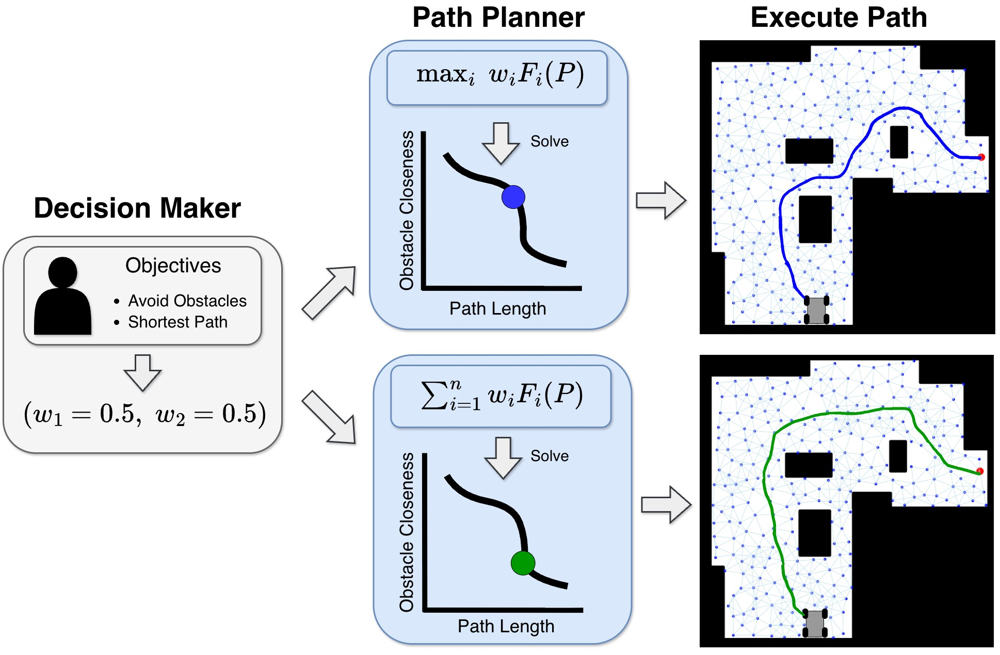

# Efficient Multi-Objective Planning with Weighted Maximization using Large Neighbourhood Search 

This repository contains the implementation of our paper "Efficient Multi-Objective Planning with Weighted Maximization using Large Neighbourhood Search" (accepted ICRA 2026)

## Overview
Path planning often requires the optimization of multiple objectives (e.g., path length, safety, energy). A common approach to solving multi-objective optimization problem is to scalarize objectives into a single cost function. 

The weighted sum (WS) scalarization is widely used, however it cannot find solutions in non-convex regions of the Pareto front, often missing critical trade-offs. The Weighted Maximum (WM) scalarization can find all Pareto-optimal solutions (including non-convex ones), however exact WM solvers are computationally expensive and impractical in discrete domains. We propose WM-LNS, a novel algorithm that leverages the Large Neighbourhood Search framework to solve the WM problem efficiently.

<p align="center">
  
  <br>
  <em>Figure 1: Solving multi-objective path planning problems via scalarization</em>
</p>

### Setup

1. Clone the repository:
   ```bash
   git clone https://github.com/krishna-kalavadia/WM-LNS.git
   cd wm-lns
   ```

2. Install dependencies:
   ```bash
   pip install -r requirements.txt
   ```

## Project Structure
```
wm-lns/
├── benchmarks/                        # Baseline comparison algorithms
│   ├── beam_search_weighted_max.py
│   ├── heuristic_weighted_max.py
│   └── weighted_sum.py
├── wm_lns/                           
│   ├── environments/                  # Environment generation tools
│   │   └── generate_environments.py
│   ├── manipulator_experiments/       # 7-DOF robot arm experiments
│   │   ├── config.py
│   │   ├── env.py
│   │   ├── robot.py
│   │   └── run_experiments.py
│   ├── planar_navigation_experiments/ # 2D navigation experiments
│   │   ├── mapping_pareto_front.py
│   │   ├── read_experiments.py
│   │   └── run_instance_experiments.py
│   ├── utils/                         # Shared utility functions
│   │   ├── common_utils.py
│   │   └── plotting_utils.py
│   ├── __init__.py
│   └── wm_lns.py                      # Core implementation of the WM-LNS
├── .gitignore
├── README.md                          
└── requirements.txt                   
```

## Running WM-LNS
For a demo of WM-LNS, the following runs WM-LNS, all baselines on the cluttered boxes environment.
```bash
python -m wm_lns.wm_lns
```
The script will plot all solutions on the environment and output performance metrics for each algorithm


## Contact
For any issues or contact, feel free to email: kkalavad@uwaterloo.ca
